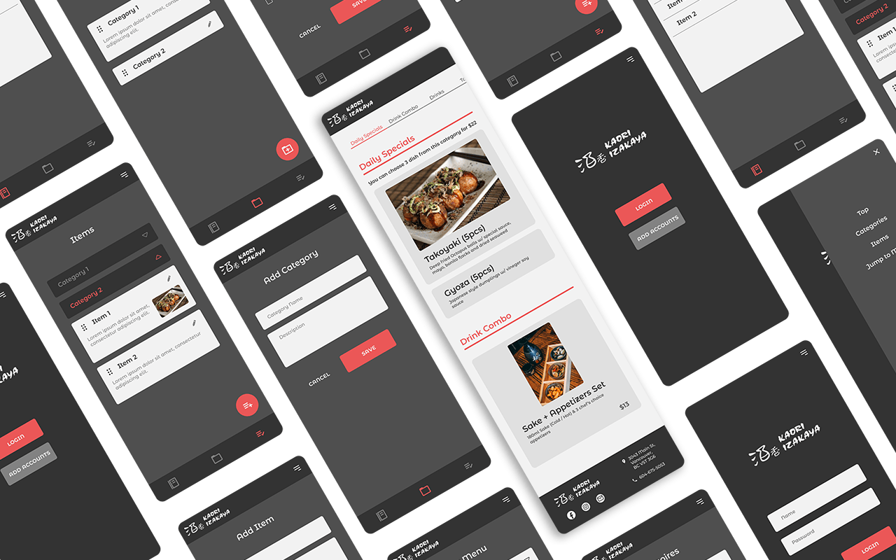

  

<h1 align="center">Kaori Izakaya Menu</h1>

  Online restaurant menu with management system

## Idea

The Restaurant is still using menu books and servers have to clean (sanitize) after customers use them.  
Well... too tired to wipe the menus... and that is pretty much damaging menus.  

So I created an online menu for the restaurant (with management system)

## Highlights

- Customers can check menus
- Support English / Japanese menu
- Secured editing page
- Easy to update menu items and categories

## Tech Stack

- Next.js
- Firebase (Authentication, Firestore)
- Material ui
- Vercel

## Refs

- [Import Data from Google Sheets](https://levelup.gitconnected.com/import-data-from-google-sheets-to-firestore-using-google-apps-script-b6f857f82a2)
