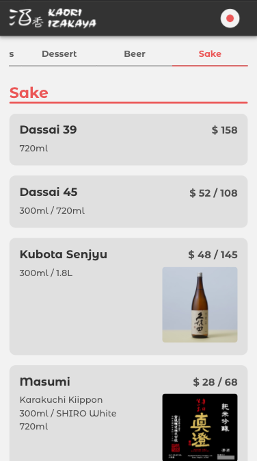
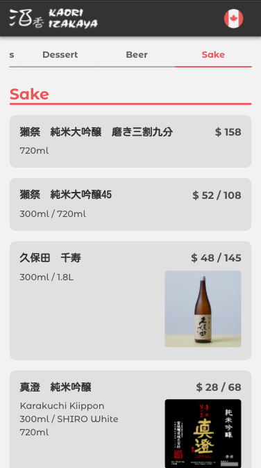
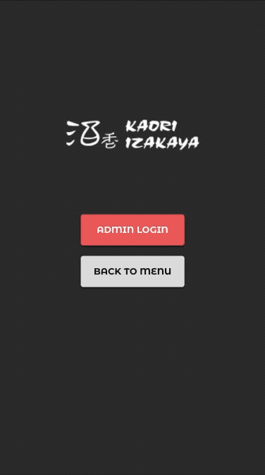
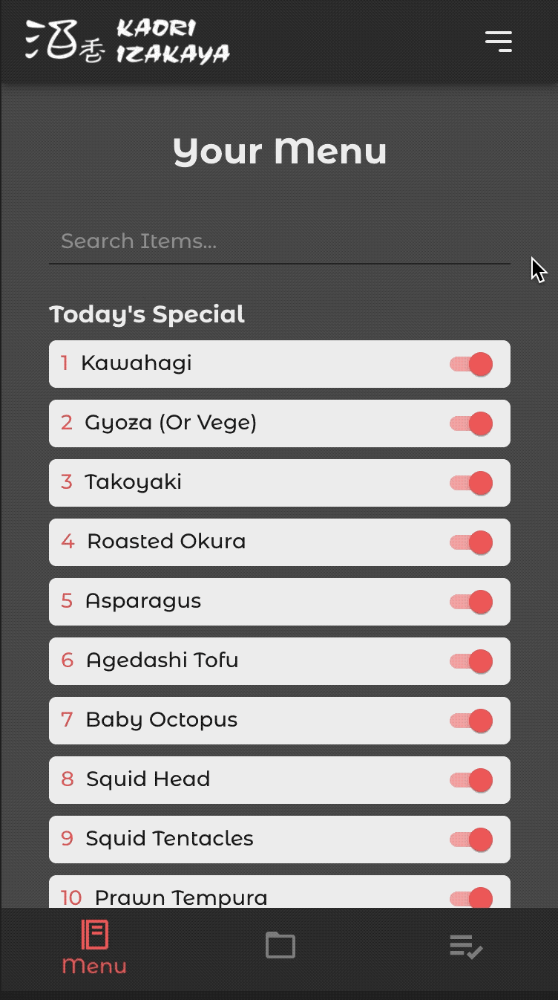
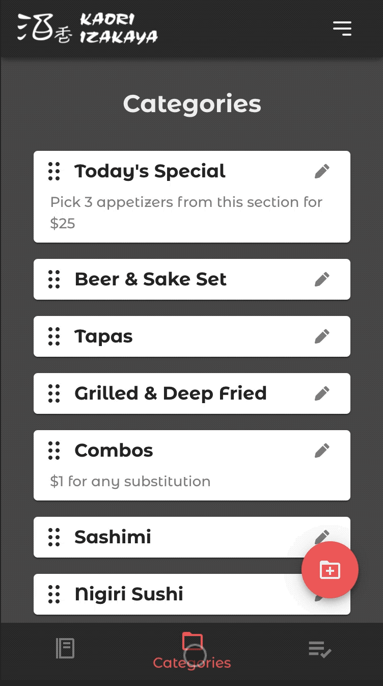
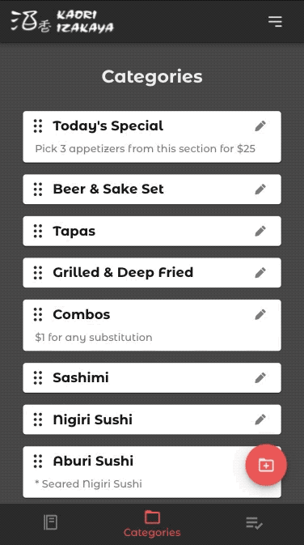
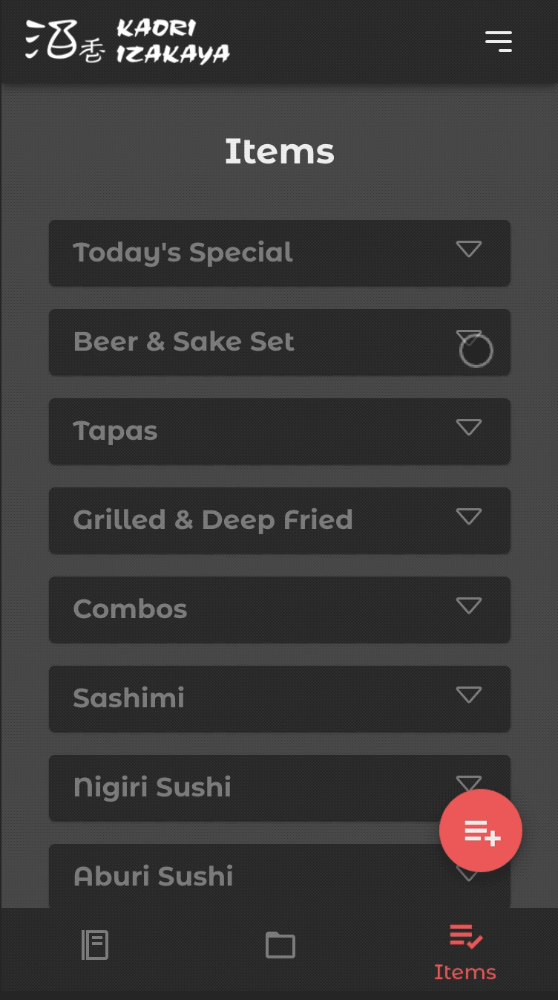
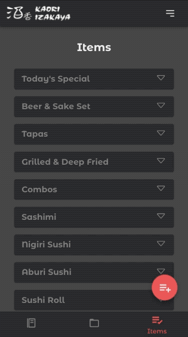

  

<h1 align="center">Kaori Izakaya Menu</h1>

  Online restaurant menu with management system

## Idea

The Restaurant is still using menu books and servers have to clean (sanitize) after customers use them.  
Well... too tired to wipe the menus... and that is pretty much damaging menus.

So I created an online menu for the restaurant (with management system)

## Highlights

- Customers can check menus
- Support English / Japanese menu
- Secured editing page
- Easy to update menu items and categories

## Features

### Restaurant Menu for Customers

[Jump to Menu](https://kaori-menu.vercel.app/)

- Multi language support

  
  

### Admin Pages

[Jump to Admin Page](https://kaori-menu.vercel.app/admin)

### Availability

- Change item display by one click
- Item name search

### Categories

- Reorder categories with Drag and drop
- Easy to edit and add

  
  

### Items

- Reorder items with Drag and drop
- Easy to edit and add

  
  

## Tech Stack

- Next.js
- Firebase (Authentication, Firestore, Storage)
- Material-UI
- Vercel
- React beautiful dnd

## Refs

- [Import Data from Google Sheets](https://levelup.gitconnected.com/import-data-from-google-sheets-to-firestore-using-google-apps-script-b6f857f82a2)

- [Firebase authentication](https://medium.com/javascript-in-plain-english/next-js-firebase-authentication-including-ssr-1045b097ee18)

- [react-beautiful-dnd tutorial](https://egghead.io/courses/beautiful-and-accessible-drag-and-drop-with-react-beautiful-dnd)
